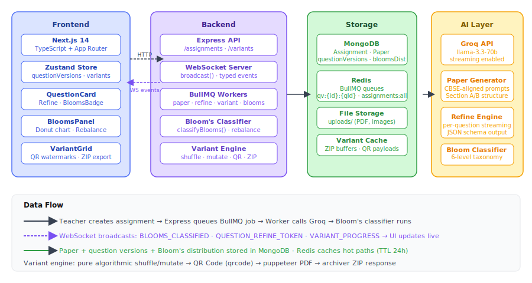
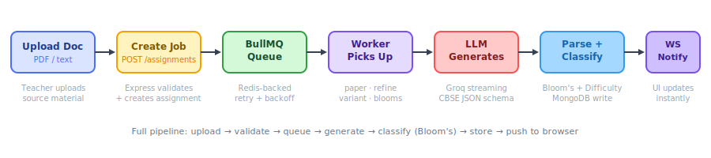

<div align="center">
  
  <h1>VedaAI — AI Assessment Creator</h1>
  <p>Generate curriculum-aligned CBSE question papers in under 30 seconds. Built for teachers, powered by AI.</p>
  
  
  
  
  
</div>

---

## What It Does

VedaAI takes a teacher's assignment brief — question types, marks, due date, optional source PDF — and generates a print-ready CBSE question paper in seconds using a streaming LLM pipeline. Every question is auto-classified against Bloom's Taxonomy, teachers can refine individual questions in natural language with live streaming rewrites, and exam coordinators can generate N anti-cheating variants in one click.

---

## System Architecture



The system has four layers: a Next.js frontend with Zustand state management handles all UI and WebSocket event subscriptions; an Express backend receives HTTP requests, manages BullMQ job queues backed by Redis, and runs four background workers; MongoDB stores assignments, generated papers, Bloom's distributions, and per-question version histories; Groq (llama-3.3-70b) powers all AI work — paper generation, per-question refinement with token streaming, and Bloom's classification.

---

## AI Generation Pipeline



When a teacher submits an assignment, Express creates a BullMQ job. The paper worker picks it up, extracts source PDF text if provided, builds a CBSE-aligned prompt, and calls Groq with `response_format: json_object`. After the paper is parsed, a second Groq call classifies every question against Bloom's 6 cognitive levels. The final paper with Bloom's distribution is written to MongoDB, and a WebSocket broadcast updates the teacher's browser instantly.

---

## Features Built

### Core
| Feature | Description | Status |
|---|---|---|
| Assignment Creation | Form with PDF upload, due date, question types, validation | Done |
| AI Question Generation | Structured CBSE paper with sections, difficulty, marks | Done |
| Real-time Progress | WebSocket updates from BullMQ worker to UI | Done |
| Output Page | Structured paper with student info section, Section A/B | Done |
| PDF Export | Browser print dialog with proper formatting | Done |

### Bonus (Beyond Requirements)
| Feature | Description | Status |
|---|---|---|
| Live Question Negotiation | Per-question streaming AI refine with full version history | Done |
| Anti-Cheating Variant Engine | N variants with shuffled questions, QR watermarks, ZIP export | Done |
| Bloom's Taxonomy Intelligence | Auto-classify all questions + donut chart + one-click rebalance | Done |

---

## Feature Deep Dives

### 1. Live Question Negotiation

Every question card has a **Refine** button that opens an inline panel. The teacher types a natural language instruction ("make this harder", "convert to MCQ with 4 options", "reduce marks to 2") and the AI rewrites only that question via a Groq streaming call — tokens stream character by character through a WebSocket channel (`QUESTION_REFINE_TOKEN` events) directly into the question text. Every rewrite is version-stamped in MongoDB under `paper.questionVersions` and cached in Redis for 24 hours (key: `qv:{assignmentId}:{questionId}`), giving the teacher a full undo history.

### 2. Anti-Cheating Variant Engine

One click opens a modal to configure 2–6 exam variants. The BullMQ variant worker applies three deterministic transforms: Fisher-Yates shuffle of question order per section, MCQ option shuffle (correct answer reference is preserved), and seeded numerical mutation on 2–3 digit numbers (e.g. "15 students" → "18 students" in Variant B). Each variant gets a QR code watermark encoding `{ variantId, label, examId }` rendered via the `qrcode` package and injected as a base64 image. All variants are assembled as PDFs via Puppeteer and zipped with `archiver`, downloadable as a single ZIP or individually.

### 3. Bloom's Taxonomy Intelligence

After every paper generation, a second Groq call classifies each question against Bloom's 6 cognitive levels (Remember → Create). The output page shows a color-coded `<BloomsBadge>` pill on every question alongside the difficulty tag. A sticky sidebar panel shows a `recharts` donut chart of the distribution. If the recall percentage (Remember + Understand) exceeds 65%, a warning banner appears with a **Rebalance** button. The rebalance worker identifies the bottom 40% of recall questions, rewrites them at higher Bloom levels via targeted Groq calls, then re-classifies the full paper and pushes the updated sections to the browser over WebSocket.

---

## Tech Stack

| Layer | Technology | Why |
|---|---|---|
| Frontend | Next.js 14, TypeScript | App Router, RSC, type safety end-to-end |
| State | Zustand | Minimal boilerplate, computed slices, no Provider wrapping |
| UI Charts | Recharts | PieChart with innerRadius for donut without a heavy charting lib |
| Backend | Node.js, Express | Lightweight, easy multer/file handling, straightforward middleware chain |
| Queue | BullMQ + Redis | Reliable job retry, backoff, concurrency control, job history |
| Cache | Redis (ioredis) | Question version cache (TTL 24h), assignment list cache (TTL 30s) |
| Database | MongoDB + Mongoose | Flexible schema for paper sections, Map type for question versions |
| AI | Groq (llama-3.3-70b) | Fast inference, streaming support, JSON response format |
| PDF | Puppeteer | Pixel-accurate rendering of HTML question paper to PDF |
| ZIP | archiver | Stream-based ZIP construction, pipe directly to response buffer |
| QR | qrcode | Canvas and data URL generation, works server-side and client-side |

---

## Local Setup

### Prerequisites
- Node.js 18+
- Docker (for Redis + MongoDB)

### Steps

1. **Start infrastructure**
   ```bash
   docker run -d -p 6379:6379 redis:alpine
   docker run -d -p 27017:27017 mongo:7
   ```

2. **Backend**
   ```bash
   cd backend
   cp .env.example .env   # fill GROQ_API_KEY, REDIS_URL, MONGO_URI
   npm install
   npm run dev
   ```

3. **Frontend**
   ```bash
   cd frontend
   cp .env.example .env.local   # fill NEXT_PUBLIC_API_URL, NEXT_PUBLIC_WS_URL
   npm install
   npm run dev
   ```

4. Open `http://localhost:3000` — create an assignment, watch it generate in real time.

### Environment Variables

**Backend (`.env`)**
```
PORT=4000
GROQ_API_KEY=gsk_...
GROQ_MODEL=llama-3.3-70b-versatile
REDIS_URL=redis://localhost:6379
MONGO_URI=mongodb://localhost:27017/vedaai
FRONTEND_URL=http://localhost:3000
SCHOOL_NAME=Delhi Public School
```

**Frontend (`.env.local`)**
```
NEXT_PUBLIC_API_URL=http://localhost:4000/api
NEXT_PUBLIC_WS_URL=ws://localhost:4000/ws
```

---

## Architecture Decisions

- **BullMQ over raw queue** — Retry with exponential backoff, concurrency caps per queue (`concurrency: 3` for paper generation, `5` for refine), and job-level failure isolation. Raw `setInterval` polling would have dropped jobs on restart.
- **Zustand over Redux** — No boilerplate, no Provider tree, direct `set()` calls from WebSocket handlers outside React. The `refiningQuestions: Set<string>` slice shows idiomatic use of non-serializable Zustand state where Redux would require a workaround.
- **Streaming WebSocket instead of polling** — The refine feature sends tokens character-by-character (`QUESTION_REFINE_TOKEN`). Polling can't achieve sub-second feedback for streaming LLM output; WebSocket is the only viable path.
- **`response_format: json_object` for non-stream calls** — Groq's `json_object` mode guarantees well-formed JSON even when the model would otherwise add markdown fences. Used for paper generation, Bloom's classification, and non-streaming refines. Streaming refines use free-form output and parse on completion.

---

## What I'd Build Next

**Collaborative teacher review** — A shared link for multiple teachers to annotate the paper, vote on question difficulty, and suggest alternatives before publishing. The version history system is already the right primitive for this.

**Adaptive question bank** — After N papers are generated, cluster past questions by topic, difficulty, and Bloom's level into a reusable bank. New paper generation draws from the bank first and falls back to live AI generation only for gaps — dramatically cutting LLM costs and improving consistency.

**Student answer sheet OCR + auto-grading** — Scan handwritten answer sheets, extract text via Google Vision or Tesseract, and score against the generated answer key using an LLM judge. Close the full assessment loop: generate → deliver → grade → report.
